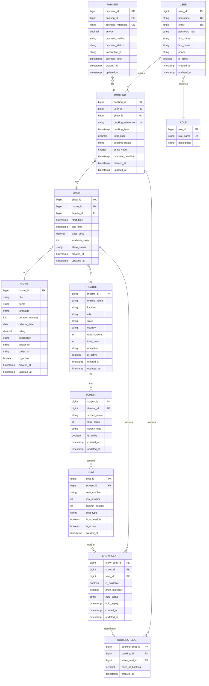

```mermaid
erDiagram
    USER ||--o{ BOOKING : "places"
    BOOKING }o--|| SHOW : "for"
    SHOW }o--|| MOVIE : "of"
    SHOW }o--|| THEATRE : "at"
    THEATRE ||--o{ SCREEN : "has"
    SCREEN ||--o{ SEAT : "contains"
    SHOW ||--o{ SHOW_SEAT : "includes"
    SEAT ||--o{ SHOW_SEAT : "used in"
    BOOKING ||--o{ BOOKING_SEAT : "includes"
    SHOW_SEAT ||--o| BOOKING_SEAT : "reserved as"
    USER }o--|| ROLE : "assigned"
    PAYMENT }o--|| BOOKING : "for"

    USER {
        bigint user_id PK
        string username UK
        string email UK
        string password_hash
        string first_name
        string last_name
        string phone
        boolean is_active
        timestamp created_at
        timestamp updated_at
    }

    ROLE {
        bigint role_id PK
        string role_name UK
        string description
    }

    MOVIE {
        bigint movie_id PK
        string title
        string genre
        string language
        int duration_minutes
        date release_date
        decimal rating
        string description
        string poster_url
        string trailer_url
        boolean is_active
        timestamp created_at
        timestamp updated_at
    }

    THEATRE {
        bigint theatre_id PK
        string theatre_name
        string location
        string city
        string state
        string country
        int total_screens
        int total_seats
        string amenities
        boolean is_active
        timestamp created_at
        timestamp updated_at
    }

    SCREEN {
        bigint screen_id PK
        bigint theatre_id FK
        string screen_name
        int total_seats
        string screen_type
        boolean is_active
        timestamp created_at
        timestamp updated_at
    }

    SEAT {
        bigint seat_id PK
        bigint screen_id FK
        string seat_number
        int row_number
        int column_number
        string seat_type
        boolean is_accessible
        boolean is_active
        timestamp created_at
    }

    SHOW {
        bigint show_id PK
        bigint movie_id FK
        bigint screen_id FK
        timestamp start_time
        timestamp end_time
        decimal base_price
        int available_seats
        string show_status
        timestamp created_at
        timestamp updated_at
    }

    SHOW_SEAT {
        bigint show_seat_id PK
        bigint show_id FK
        bigint seat_id FK
        boolean is_available
        decimal price_multiplier
        string hold_status
        timestamp hold_expiry
        timestamp created_at
        timestamp updated_at
    }

    BOOKING {
        bigint booking_id PK
        bigint user_id FK
        bigint show_id FK
        string booking_reference UK
        timestamp booking_time
        decimal total_price
        string booking_status
        integer seats_count
        timestamp payment_deadline
        timestamp created_at
        timestamp updated_at
    }

    BOOKING_SEAT {
        bigint booking_seat_id PK
        bigint booking_id FK
        bigint show_seat_id FK
        decimal price_at_booking
        timestamp created_at
    }

    PAYMENT {
        bigint payment_id PK
        bigint booking_id FK
        string payment_reference UK
        decimal amount
        string payment_method
        string payment_status
        string transaction_id
        timestamp payment_time
        timestamp created_at
        timestamp updated_at
    }
```