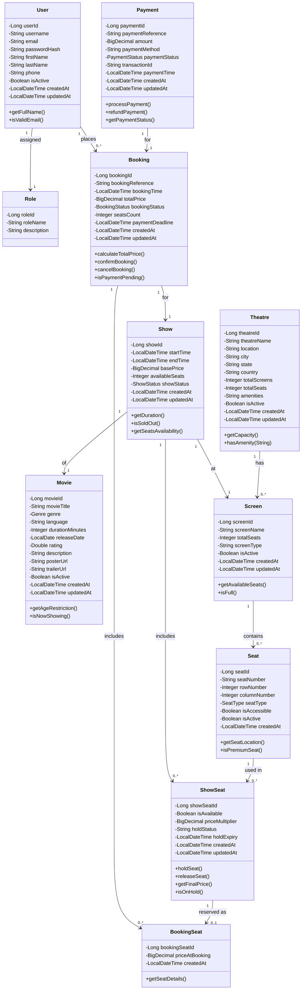

```mermaid
classDiagram
    class User {
        -Long userId
        -String username
        -String email
        -String passwordHash
        -String firstName
        -String lastName
        -String phone
        -Boolean isActive
        -LocalDateTime createdAt
        -LocalDateTime updatedAt
        +getFullName()
        +isValidEmail()
    }
    
    class Role {
        -Long roleId
        -String roleName
        -String description
    }
    
    class Movie {
        -Long movieId
        -String movieTitle
        -Genre genre
        -String language
        -Integer durationMinutes
        -LocalDate releaseDate
        -Double rating
        -String description
        -String posterUrl
        -String trailerUrl
        -Boolean isActive
        -LocalDateTime createdAt
        -LocalDateTime updatedAt
        +getAgeRestriction()
        +isNowShowing()
    }
    
    class Theatre {
        -Long theatreId
        -String theatreName
        -String location
        -String city
        -String state
        -String country
        -Integer totalScreens
        -Integer totalSeats
        -String amenities
        -Boolean isActive
        -LocalDateTime createdAt
        -LocalDateTime updatedAt
        +getCapacity()
        +hasAmenity(String)
    }
    
    class Screen {
        -Long screenId
        -String screenName
        -Integer totalSeats
        -String screenType
        -Boolean isActive
        -LocalDateTime createdAt
        -LocalDateTime updatedAt
        +getAvailableSeats()
        +isFull()
    }
    
    class Seat {
        -Long seatId
        -String seatNumber
        -Integer rowNumber
        -Integer columnNumber
        -SeatType seatType
        -Boolean isAccessible
        -Boolean isActive
        -LocalDateTime createdAt
        +getSeatLocation()
        +isPremiumSeat()
    }
    
    class Show {
        -Long showId
        -LocalDateTime startTime
        -LocalDateTime endTime
        -BigDecimal basePrice
        -Integer availableSeats
        -ShowStatus showStatus
        -LocalDateTime createdAt
        -LocalDateTime updatedAt
        +getDuration()
        +isSoldOut()
        +getSeatsAvailability()
    }
    
    class ShowSeat {
        -Long showSeatId
        -Boolean isAvailable
        -BigDecimal priceMultiplier
        -String holdStatus
        -LocalDateTime holdExpiry
        -LocalDateTime createdAt
        -LocalDateTime updatedAt
        +holdSeat()
        +releaseSeat()
        +getFinalPrice()
        +isOnHold()
    }
    
    class Booking {
        -Long bookingId
        -String bookingReference
        -LocalDateTime bookingTime
        -BigDecimal totalPrice
        -BookingStatus bookingStatus
        -Integer seatsCount
        -LocalDateTime paymentDeadline
        -LocalDateTime createdAt
        -LocalDateTime updatedAt
        +calculateTotalPrice()
        +confirmBooking()
        +cancelBooking()
        +isPaymentPending()
    }
    
    class BookingSeat {
        -Long bookingSeatId
        -BigDecimal priceAtBooking
        -LocalDateTime createdAt
        +getSeatDetails()
    }
    
    class Payment {
        -Long paymentId
        -String paymentReference
        -BigDecimal amount
        -String paymentMethod
        -PaymentStatus paymentStatus
        -String transactionId
        -LocalDateTime paymentTime
        -LocalDateTime createdAt
        -LocalDateTime updatedAt
        +processPayment()
        +refundPayment()
        +getPaymentStatus()
    }
    
    User "1" --> "0..*" Booking : places
    Booking "1" --> "1" Show : for
    Show "1" --> "1" Movie : of
    Show "1" --> "1" Screen : at
    Theatre "1" --> "0..*" Screen : has
    Screen "1" --> "0..*" Seat : contains
    Show "1" --> "0..*" ShowSeat : includes
    Seat "1" --> "0..*" ShowSeat : used in
    Booking "1" --> "0..*" BookingSeat : includes
    ShowSeat "1" --> "0..1" BookingSeat : reserved as
    User "1" --> "1" Role : assigned
    Payment "1" --> "1" Booking : for
```