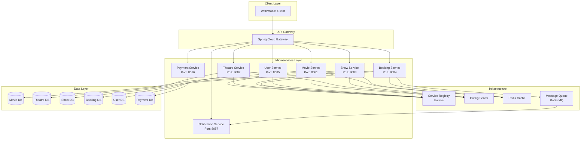

```mermaid
graph TB
subgraph "Client Layer"
UI[Web/Mobile Client]
end

    subgraph "API Gateway"
        GW[Spring Cloud Gateway]
    end
    
    subgraph "Microservices Layer"
        MS1[Movie Service<br/>Port: 8081]
        MS2[Theatre Service<br/>Port: 8082]
        MS3[Show Service<br/>Port: 8083]
        MS4[Booking Service<br/>Port: 8084]
        MS5[User Service<br/>Port: 8085]
        MS6[Payment Service<br/>Port: 8086]
        MS7[Notification Service<br/>Port: 8087]
    end
    
    subgraph "Infrastructure"
        REG[Service Registry<br/>Eureka]
        CONFIG[Config Server]
        CACHE[Redis Cache]
        MQ[Message Queue<br/>RabbitMQ]
    end
    
    subgraph "Data Layer"
        DB1[(Movie DB)]
        DB2[(Theatre DB)]
        DB3[(Show DB)]
        DB4[(Booking DB)]
        DB5[(User DB)]
        DB6[(Payment DB)]
    end
    
    UI --> GW
    GW --> MS1
    GW --> MS2
    GW --> MS3
    GW --> MS4
    GW --> MS5
    GW --> MS6
    GW --> MS7
    
    MS1 --> REG
    MS2 --> REG
    MS3 --> REG
    MS4 --> REG
    MS5 --> REG
    
    MS1 --> CONFIG
    MS2 --> CONFIG
    MS3 --> CONFIG
    
    MS1 --> CACHE
    MS3 --> CACHE
    MS4 --> CACHE
    
    MS4 --> MQ
    MQ --> MS7
    
    MS1 --> DB1
    MS2 --> DB2
    MS3 --> DB3
    MS4 --> DB4
    MS5 --> DB5
    MS6 --> DB6
```